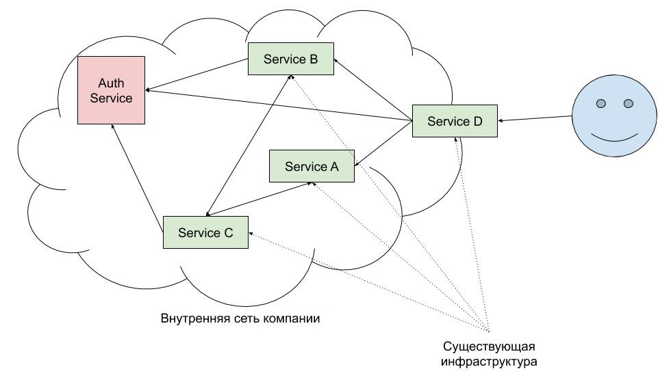

# Сервис проверки прав доступа к ресурсам

_Задание по курсу "Высоконагруженные веб-системы"._

## Легенда

Наша задача - написать систему проверки прав доступа пользователей к ресурсам “Auth Service”.

Система будет внедрена в уже готовую среду, содержащую множество внутренних сервисов компании. 
Сервисы, которым необходимо осуществлять контроль за правомерностью запросов, написаны на C++/Java/Python
и используют для общения друг с другом и фронтенд-сервисом технологию RPC, передавая все данные с
помощью технологии Protocol Buffer.

## Алгоритм работы системы

“Service D” занимается обработкой запросов от пользователей и их перенаправлением внутренним сервисам 
через RPC. Обработка запроса:

1.  “Service D” принимает запрос от пользователя. Если это операции с сессией (Login/Logout), то запрос 
сразу переадресовывается нашему модулю, иначе (если запрос на вычисления/доступ к файлам/др.) перенаправляет 
на сервер с какой-то другой службой.
    
2.  Произвольный внутренний сервис, получивший запрос, выполняет его обработку за время вызова RPC-метода и 
возвращает результат его выполнения. Если необходимо обращение к другим сервисам, то он отсылает запросы (сколь
угодно много раз). Информация о сессии (ID сессии + ключ безопасности) также пересылается между серверами как 
часть запроса в виде вложенного сообщения.
    
3.  Если в какой-то момент для обработки запроса какому-нибудь из внутренних серверов необходимо проверить права 
на доступ к какому-либо ресурсу, то он направляет соответствующий запрос в Auth Service, передавая имя ресурса и 
ифнормацию о сессии.

## Выбор технологий для нашего сервиса

Так как сервис будет интегрироваться в большую экосистему, в которой уже применяются RPC+ProtoBuf (в частности, 
для передачи информации о сессии между сервисами), то логичнее всего выбрать именно их и для нашего модуля. 

RPC возьмёт на себя всю нагрузку по обеспечению соединений и организации передачи, а ProtoBuf возьмёт на себя всю
нагрузку по преобразованию передаваемых данных между различными форматами. 

Заметим также, что у разработчиков сервисов будет возможность простого подключения нашего модуля, ведь количество
кода будет минимально (почти всё скрыто внутри gRPC и ProtocolBuffers, с которыми они и так уже все знакомы), 
что сделает внедрение быстрым, а разработчиков - счастливыми :)

## Сущности
| Наименование | Описание                                                           |
| ---          | ---                                                                |
| Credentials  | Данные пользователя, необходимые для открытия новой сессии.        |
| Cookie       | Публичная информация о сессии, которая передается между сервисами. |
| Status       | Вспомогательная структура для передачи статуса выполнения операции |

Формат хранения данных сущностей, а также запросов и ответов на RPC-запросы определён в файле [auth.proto](auth.proto).

## Алгоритм обработки запросов к сервису

### Login
1.  Логин и пароль проверяются по базе данных. Если нет совпадений -- возвращаем ошибку (ACCESS_DENIED).
2.  Создаётся Cookie с новым ID сессии и случайным ключом
3.  Информация о сессии (Cookie + ID пользователя) сохраняется во внутренней базе данных.
4.  В качестве результата возвращаются Cookie и статус OK.
 
### Logout
1.  Проверяется существование сессии и соответствие ключа. Если нет совпадений - возвращается ошибка (INVALID_SESSION).
2.  Информацию о сессии удаляется из внутренней базы данных.
3.  Возвращается статус OK.
 
### Validate
1.  Проверяется существование сессии и соответствие ключа. Если нет совпадений - возвращается ошибка (INVALID_SESSION).
2.  Проверяется наличие записи о разрешении доступа пользователя к указанному в запросе ресурсу. 
Если нет найдено - возвращается ошибка (ACCESS_DENIED).
4.  Если запись о наличии прав есть, то возвращается статус OK.
